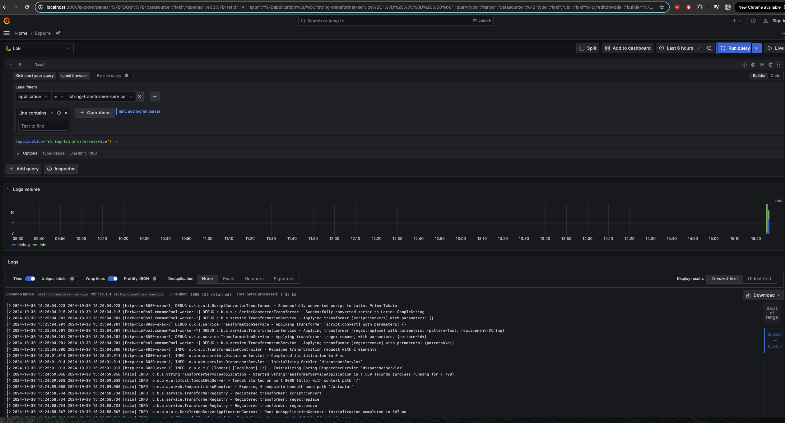
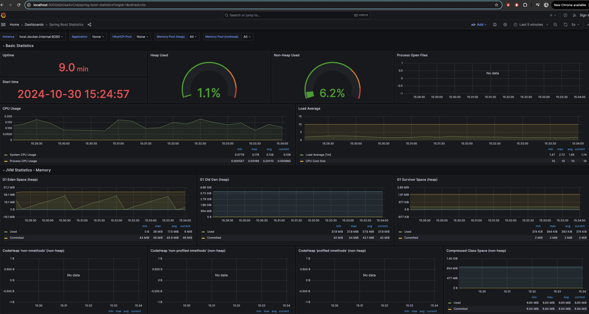
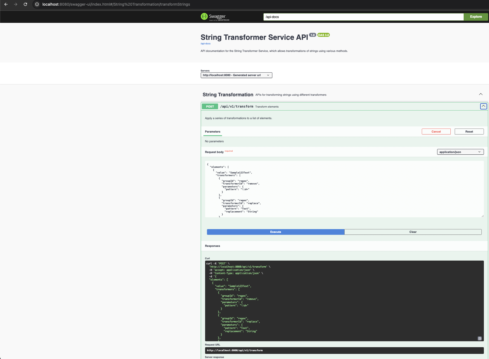

# String Transformer Service

## Overview
String Transformer Service is a Spring Boot-based application that applies a series of transformations to strings. It supports various types of transformations, including regex-based replacements and script conversions (e.g., Cyrillic/Greek to Latin).

## Features
- Accepts a collection of elements, each with a string value and a list of transformers.
- Applies transformations in the specified order and returns both the original and transformed values.
- Provides built-in validation for inputs, including null checks and parameter validation.
- Supports extensible transformer architecture through annotations.

## Architecture

The architecture consists of the following components:
- **Spring Boot application**: Core backend service for string transformation.
- **Prometheus**: Used for metrics scraping.
- **Loki**: Used for log aggregation.
- **Grafana**: Used for metrics and log visualization.

### Run the application and monitoring stack using Docker Compose:

docker-compose up -d


## API Endpoints

```bash
curl -X POST http://localhost:8080/api/v1/transform \
  -H "Content-Type: application/json" \
  -d '{
    "elements": [
      {
        "value": "Sample123Text",
        "transformers": [
          {
            "groupId": "regex",
            "transformerId": "remove",
            "parameters": {
              "pattern": "\d+"
            }
          },
          {
            "groupId": "regex",
            "transformerId": "replace",
            "parameters": {
              "pattern": "Text",
              "replacement": "String"
            }
          },
          {
            "groupId": "script",
            "transformerId": "convert",
            "parameters": {}
          }
        ]
      },
      {
        "value": "Пример456Текстα",
        "transformers": [
          {
            "groupId": "regex",
            "transformerId": "remove",
            "parameters": {
              "pattern": "\d+"
            }
          },
          {
            "groupId": "script",
            "transformerId": "convert",
            "parameters": {}
          }
        ]
      }
    ]
  }' | jq
```


### Response:

```json
[
	{
		"originalValue": "Sample123Text",
		"transformedValue": "SampleString"
	},
	{
		"originalValue": "Пример456Текстα",
		"transformedValue": "PrimerTeksta"
	}
]
```
### Grafana Dashboard: http://localhost:3000 (no login required)





### Swagger docs http://localhost:8080/swagger-ui/index.html




